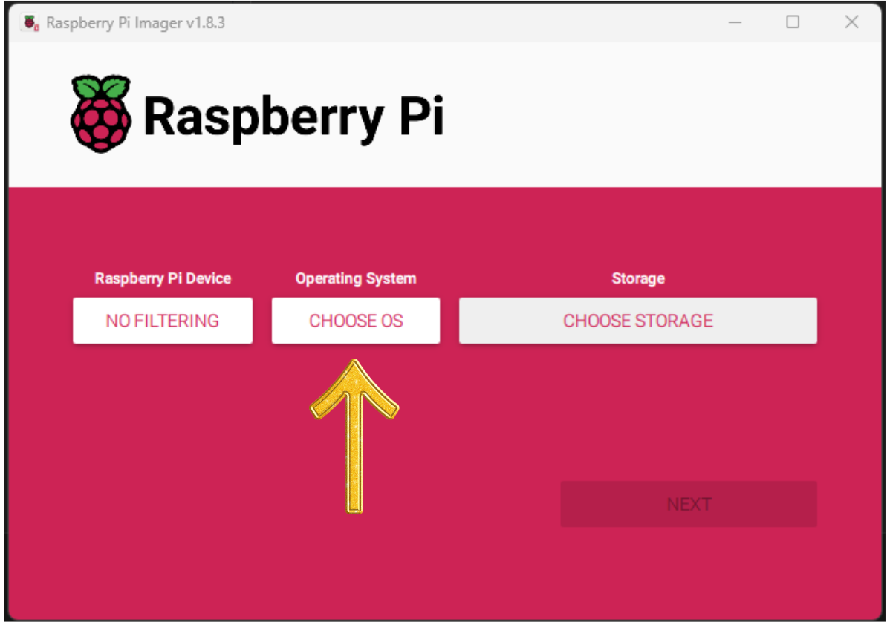
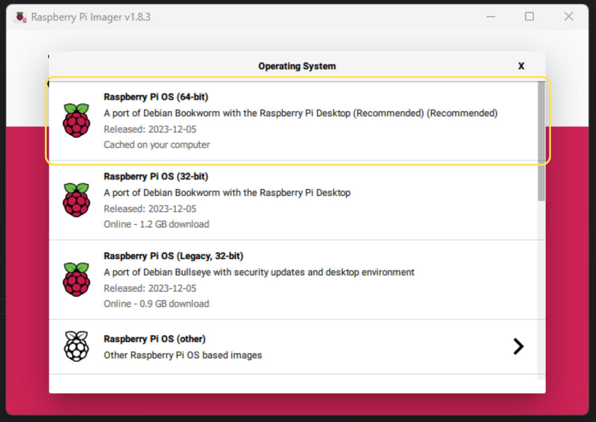
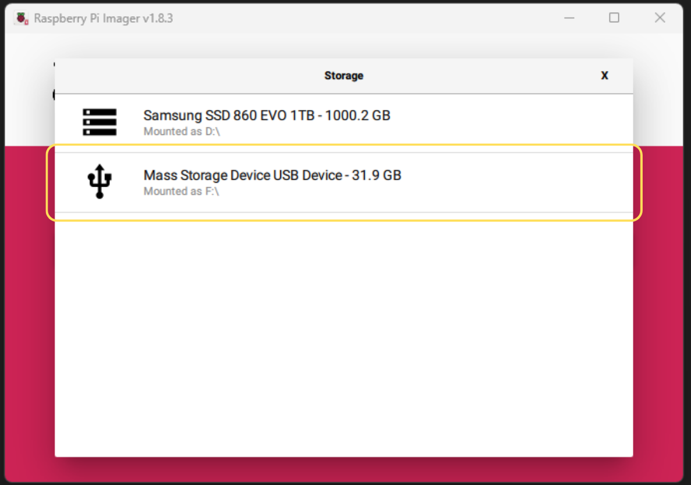
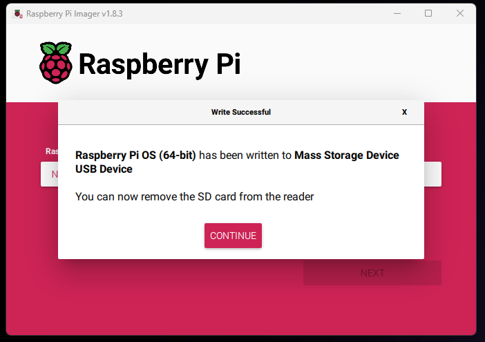
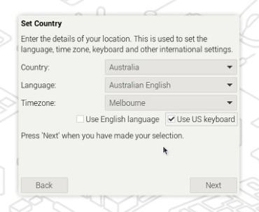
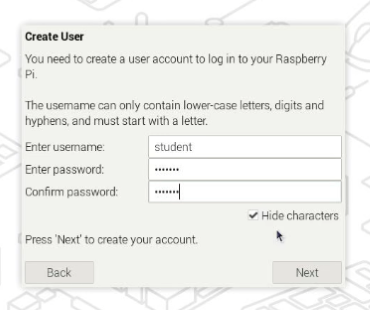
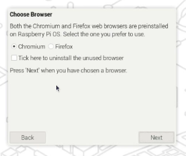
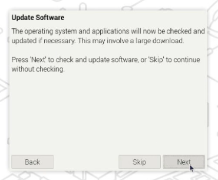
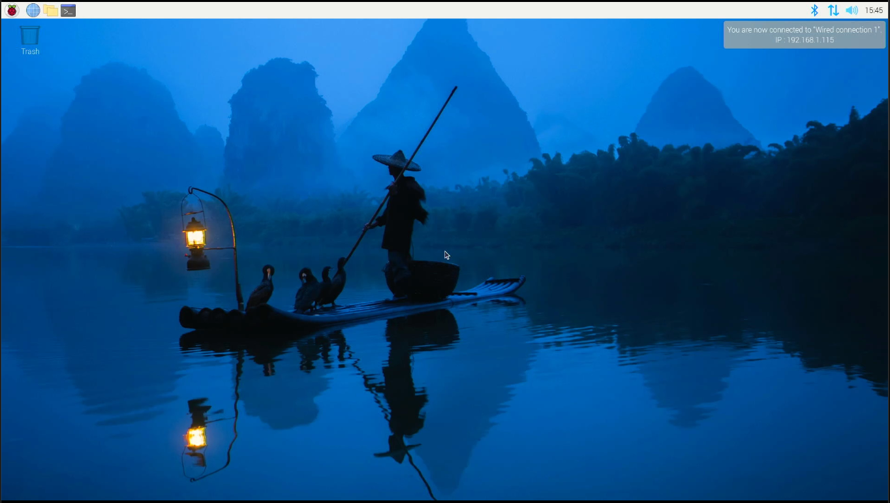

This Article will show you how to setup your Raspberry Pi software including:

- Download and burn Raspberry Pi OS to an SD card.
- Installing Raspberry Pi OS.
- Installing programs used in the Field Guide.

## Download Raspberry Pi OS

1. Download and install the Raspberry Pi Imager from [raspberrypi.org](https://www.raspberrypi.org/software/)
    - Select the version for your operating system.
    - Run the installer and follow the instructions.
1. Insert the micro SD card into your computer.
    - You may need a Micro SD card adapter and/or a USB SD card reader.
    - Recommend at least 16 GB micro SD card
1. Open the Raspberry Pi Imager.
1. Click CHOOSE OS.
  
1. Select Raspberry Pi OS (64b-bit)
  
1. Click storage and select the micro SD card and click next.
    - **WARNING**: Make sure you select the correct storage device. Selecting the wrong device will result in the data on that device being erased.
    - In the image we are using a 32 GB micro SD card connected via a USB SD card reader.
  
1. Click `No` to the question "Would you like to apply OS customisation setting?
    - Optionally you can click edit settings to preconfigure options like the hostname, password, and Wi-Fi settings. Click yes if you want to do this.
1. Click `Yes` to the question Are you sure you want to continue?
    - **WARNING**: This will erase all data on the selected storage device.
1. Wait until the Raspberry Pi Imager has Downloaded, written and verified the image on micro SD card. (This may take a while)
1. Click continue and remove the micro SD card from your computer.
    

## Install Raspberry Pi OS

1. Insert the micro SD card into the Raspberry Pi and power on. (see [Build my Raspberry Pi](./1-0-pi-computer.md) for setup instructions)
1. On the Welcome screen click next.
1. Set your country, language and time zone and click next.
    - For Australia click use US keyboard layout.

1. Set your username and password, click next.

1. Optional Select Wi-Fi network and enter password, click next.

1. Select your preferred Browser Chromium or Firefox, Click next.

1. Optional Update Software, Click next.
    - **Note** This Process will take some time click skip to perform this task later.

1. Pi will now restart.
1. After the reboot you will be presented with the Raspberry Pi Desktop. OS Install Complete.

<!-- ## Going Hard Core! Boot to the terminal

## Switch to Zsh

## Testing the Graphical User Interface -->

<!-- refer to set up my linux box -->
