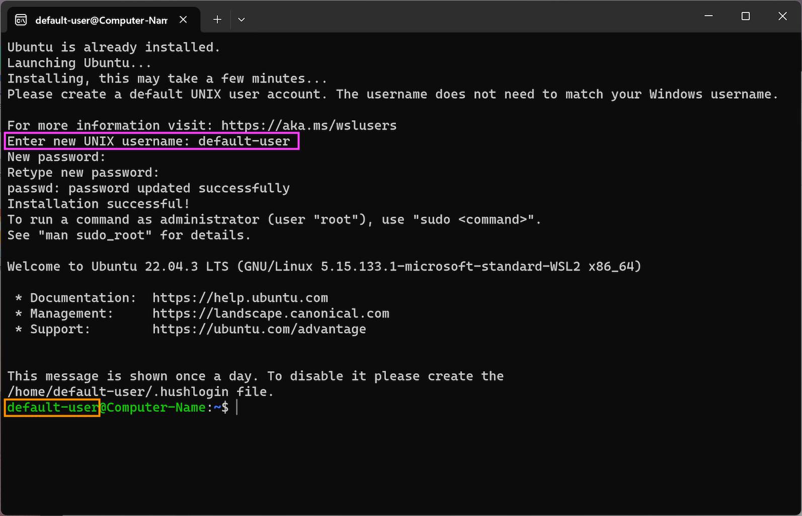
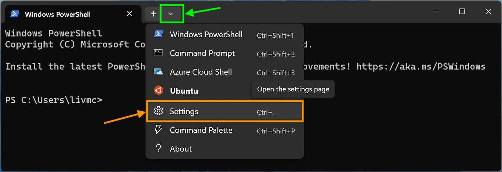
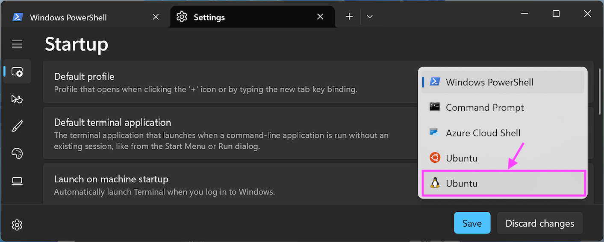

In this guide, we will walk through the steps to install the necessary Applications and Tools on **WSL** (**W**indows **S**ubsystem for **L**inux) *with Ubuntu*. This will enable you to code in C# and C++ with SplashKit.

Now, let's get started!

To set up WSL and install SplashKit and other coding tools on Windows, follow the steps outlined below:

## 1. Install Windows Subsystem for Linux (WSL)

Windows Subsystem for Linux (WSL) is a feature of Windows that allows you to run a Linux environment on your Windows machine, without the need for a separate virtual machine or dual booting.

:::note[WSL 1 vs WSL 2]
*WSL 2 (recommended) is the default version, but you can look at [this article](https://learn.microsoft.com/en-us/windows/wsl/install-manual) if you have issues, or if you are using an older Windows 10 version.*
:::

### Method 1: Command Line

You can install both WSL and Ubuntu from the command-line using the following steps that have been adapted from the instructions provided in the official Microsoft documentation: [Install Windows Subsystem for Linux (WSL)](https://learn.microsoft.com/en-us/windows/wsl/install). This is the recommended method.

Open Terminal, PowerShell or Windows Command Prompt in *administrator mode* by right-clicking and selecting "Run as administrator", then copy and paste the following command to install WSL and Ubuntu:

```bash
wsl --install
```


### Method 2: Microsoft Store

Alternatively, you can install WSL (and Ubuntu) directly from the Microsoft Store if you have this on your Windows computer.

To do this, search "WSL" in the Microsoft Store app (as shown below), or [click this link](https://apps.microsoft.com/store/detail/9P9TQF7MRM4R).


You will also need to download **Ubuntu** from the Microsoft Store. Search "Ubuntu" in the Microsoft Store app, or [click this link](https://apps.microsoft.com/store/detail/9PDXGNCFSCZV).

### Create Ubuntu User Account

Firstly, you need to **Restart** your computer if you haven't done so already.

A terminal window installing Ubuntu should pop up automatically, otherwise open the WSL or Ubuntu app for this window to open.

When prompted, enter your new UNIX username and password.  
For example, with the username "**default-user**", your terminal would look like this:



You can see in the image above where the "**default-user**" username was first entered (shown in the pink box), and the same username being used with the terminal prompt (shown in the orange box).

WSL is now setup and ready to use!

### Configure 'Windows Terminal'

Note: This step is *optional*.

If you want to be able to have your 'Windows **Terminal**' app automatically open with WSL, you can change the *Default profile* to use WSL (with Ubuntu) using the steps below:

Firstly, open the Terminal app, and click the drop-down arrow at the top of the window (shown in the green box in the image below), then click on "Settings" (shown in the orange box):



Next, click on the drop-down menu within the *Default profile* section and select either of the **Ubuntu** profiles. *If you're unsure, select the one with the Linux penguin icon* (shown in the pink box):



Click **Save**. (Don't forget this!)

Now your Terminal app will automatically use the WSL/Ubuntu command line when you open it.

:::note
Don't worry if you have different profiles in your Settings, as long as you can see at least one profile that has "Ubuntu" in the name (if you are using the default setup from [step 1](#1-install-windows-subsystem-for-linux-wsl)).
:::

:::tip[Pin it!]
To make it easier to open each time, you can pin your Terminal to the Taskbar.

- Open the Terminal App.
- Right-click on the Terminal App icon in the taskbar (shown in the orange box in the image below).
- Select "Pin to taskbar" (shown in the pink box):


:::

## 2. Install Command Line Tools

To install SplashKit on WSL, you will firstly need to install the `git` and `curl` tools using the `apt` command, which works with Ubuntu's **A**dvanced **P**ackaging **T**ool.

Firstly, open your WSL Terminal by searching for "WSL" in the Windows Start menu and then select the **WSL** App. You can also use the app for the Linux distribution you installed, such as **Ubuntu**, which is installed by default. Or you can use the Windows Terminal app if you followed the steps above.

Update the package lists by running the following command in your **WSL Terminal**:

```bash
sudo apt update
```

Next, install the `git` and `curl` tools by running the following command:

```bash
sudo apt install git curl
```


## 3. Install SplashKit SDK

SplashKit is a beginner's all-purpose software toolkit that will allow you to create fun and exciting programs more easily, especially for Graphical User Interface (GUI) programs.

:::tip[Curious to know more?]
The **SplashKit SDK** is installed using the `skm-install.sh` shell script which is stored in the [**skm**](https://github.com/splashkit/skm) GitHub repository (in the **install-scripts** folder).

It will also add the required paths to your PATH environment variable.
:::

Copy and paste the following command into your WSL Terminal to download and run the SplashKit installer:

```bash
bash <(curl -s https://raw.githubusercontent.com/splashkit/skm/master/install-scripts/skm-install.sh)
```


:::danger[My install command is not working. Help!]
If the command above does not produce any response, ensure that your computer is connected to the internet and try disabling your firewall.

***Still no luck?***  
If you still encounter issues, you can download the install script locally by right-clicking on [this link](https://raw.githubusercontent.com/splashkit/skm/master/install-scripts/skm-install.sh) and selecting "Save Link As".

To run the downloaded shell script, open the **Git Bash** Terminal and navigate to the folder where you saved the file. Then run the following command:

```bash
bash skm-install.sh
```

:::

Close and reopen the WSL Terminal, then run the command below to build SplashKit:

```bash
skm linux install
```

:::note
If prompted, enter your password, type `y`, and press enter to confirm the installation.

This may take a while (approx. 10 mins).

Command above being run in WSL terminal is shown in the next section below.
:::

## 4. Install SplashKit Globally

Finally, you will need to install the SplashKit Global Libraries. This will install the SplashKit libraries and library include files into the system's default global locations so that the compiler can find these files when building (compiling) programs created with SplashKit.

To install SplashKit globally on your WSL, copy and paste the following command into your WSL Terminal window:

```bash
skm global install
```


:::note[What does this command do specifically?]
The command above will add the **SplashKit libraries** into the `/usr/local/lib/` folder, and the required **SplashKit library include files** into the `/usr/local/include` folder.
:::

## 5. Install Visual Studio Code

Visual Studio Code, also commonly known as *VS Code* or just *Code*, is a powerful and versatile code editor that enables efficient coding, debugging, and collaboration for your SplashKit projects!

:::note[VS Code has it all!]
Once you have your code project set up, Visual Studio Code will be the main program you will use to write, build, run and debug your code.
:::

Download and run the installer from: [code.visualstudio.com/Download](https://code.visualstudio.com/Download).


:::tip[Open Code from Terminal]
You can open Visual Studio Code from the Terminal by typing `code` and pressing enter. `code .` will open the current folder in Visual Studio Code.

*You will need to close and reopen your terminal after installing VS Code for the above commands to work.*
:::

### Recommended Extensions

The final step to complete the setup of VS Code is to install a few *Extensions* in VS Code:

[**Set up my VS Code Extensions**](../2-7-setup-vscode)

Go to the page linked above, follow the steps to install both the C# and C/C++ recommended extensions, and then come back here and continue to the next step. *You can use the "Back button" in your browser to return to this page.*

## 6. Install Language Specific Tools

Some coding languages require specific tools/frameworks to be installed to be able to build and run your code files.  
As you will be coding in C# and C++ in this book, let's look at the tools needed for these languages:

### C# Tools

For coding in C#, you will need to install the `.NET` SDK which will allow you to use the *dotnet* terminal command to create, build, and run your C# project code.

#### Method 1

Download the latest version of the .NET SDK for Linux using the instructions in the official [Install .NET on Linux](https://learn.microsoft.com/en-us/dotnet/core/install/linux) guide.

:::note[Which SDK version?]
We recommend using *.NET 8.0*, but you can use *.NET 7.0*, or *.NET 6.0* if you have issues with .NET 8.0.
:::

#### Method 2

If you are confused by the steps in the link above, you can install the *.NET SDK* with the script we have created.

To do this, open your WSL terminal and run the following commands:

```bash
# Get Ubuntu version
declare repo_version=$(if command -v lsb_release &> /dev/null; then lsb_release -r -s; else grep -oP '(?<=^VERSION_ID=).+' /etc/os-release | tr -d '"'; fi)

# Download Microsoft signing key and repository
wget https://packages.microsoft.com/config/ubuntu/$repo_version/packages-microsoft-prod.deb -O packages-microsoft-prod.deb

# Install Microsoft signing key and repository
sudo dpkg -i packages-microsoft-prod.deb

# Clean up
rm packages-microsoft-prod.deb

# Update packages
sudo apt update

# Install .NET 8.0
sudo apt-get install dotnet-sdk-8.0
```

The script above will install .NET 8.0, but if you want to install an earlier version, you can update the last line with your preferred version.  
*For example*, if you want to use .NET 7.0: `sudo apt install dotnet-sdk-7.0`

:::note
If prompted, enter your password, type `y`, and press enter to confirm the installation.

This may take a while (approx. 10 mins).
:::

### C/C++ Tools

For coding in C++, you will need a C++ compiler and debugger. WSL comes with GCC (GNU Compiler Collection) and GDB (GNU Debugger) by default.

Ensure they are installed by running the following commands:

```bash
apt list g++
apt list clang
apt list gdb
```

If they are not already installed, or there are additional versions, you can use the following commands to install these tools:

```bash
sudo apt-get install g++
sudo apt-get install clang
sudo apt-get install gdb
```

These commands will install the necessary C/C++ compilers and debuggers for your development environment if they haven't been installed already.

Your Windows machine is now set up with WSL, Visual Studio Code, and SplashKit, ready for C# and C++ development. Happy coding!
